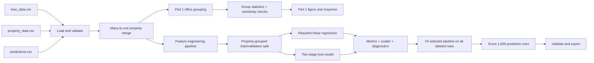

# MBS Severity Analysis: Workflow and Design Plan

**Status:** Proposed implementation plan  
**Repository reviewed:** 2026-09-01  
**Scope:** Complete the two-part analyst assignment reproducibly, explain the results clearly, and leave a defensible path from exploratory analysis to out-of-sample severity predictions.

## 1. Recommended outcome

Build a small, reproducible analysis project around four required submission artifacts:

1. `part1.ipynb` — merge validation, office classification, summary statistics, and the Part 1 figure.
2. `part1.txt` — concise interpretation of the office-distress comparison.
3. `part2.py` — preprocessing, the required ordinary linear-regression baseline, diagnostics, an optional improved model, and scoring of `predictions.csv`.
4. `part2.txt` — feature rationale, metrics, diagnosis of linear regression, and the improved-model recommendation.

The implementation should treat the supplied files as immutable inputs, build preprocessing and models as fitted pipelines, and generate every reported number from code. The final hand-in directory should contain the four required files only; supporting code, tests, plots, and environment files can remain in the working repository.

## 2. What exists now

The repository contains data and the assignment specification, but no analysis code, tests, environment declaration, or written responses.

| File | Role | Observed shape/state |
|---|---|---:|
| `ml_assessment_analyst_-_v4_2026.docx` | Authoritative assignment specification | 3 pages; Parts 1 and 2 plus submission rules |
| `loan_data.csv` | Labeled loan-level development data | 39,699 rows × 13 columns |
| `property_data.csv` | Property-level attributes | 37,858 rows × 8 columns |
| `predictions.csv` | Unlabeled scoring data | 1,000 rows × 13 columns; `severity` is entirely empty |

Key relationships:

- `loan_id` is unique in both loan files and should be retained as an identifier, not used as a feature.
- `propname` is unique in `property_data.csv`; the correct merge is therefore loan-to-property `many_to_one`.
- Every training and scoring row currently has a matching property row.
- One property can back several loans: 2,033 training properties have more than one loan. Validation must prevent the same property leaking across train and test partitions.
- There is no current source code to preserve, so the first implementation can establish conventions cleanly.

## 3. Analytical contract

### 3.1 Unit of analysis

Use one loan as the primary observation. Join property attributes onto loans with:

```python
loans.merge(properties, on="propname", how="left", validate="many_to_one")
```

Assert that the merge does not change the loan-row count and that no rows are unmatched. Do not aggregate loans before the primary analysis because severity is supplied at loan level. Property-level and loan-balance-weighted summaries are useful sensitivity checks, not replacements for the requested loan-level mean.

### 3.2 Target

`severity` is the continuous response for Part 2, but it has two material properties:

- 33,319 of 39,699 observations (83.9%) are exactly zero.
- 108 values exceed the specification's stated `[0, 1]` range; the maximum is 13.6473.

This makes severity a zero-inflated, right-skewed target with data-contract exceptions. The required linear regression must still be implemented. It should be evaluated on the raw supplied target for fidelity, with a separately labeled sensitivity run using a stakeholder-approved policy such as capping to `[0, 1]`. Never silently clip the training labels.

Before finalizing results, record one explicit decision:

- **Recommended default:** preserve raw target values in the required baseline, disclose the 108 exceptions, and report a capped-target sensitivity result. Use capped outputs only if severity is confirmed to be a fractional loss rate rather than an uncapped loss ratio or data error.

### 3.3 Office classification for Part 1

Create one deterministic, tested function after trimming whitespace and normalizing case:

1. `office`: `cssaproptype == "OF"`.
2. `mixed_unit_with_office`: mixed-use rows (`cssaproptype == "MU"` or normalized `proptype == "mixed use"`) whose `proptypelong` contains the token `office`.
3. `non_office`: all clearly non-office properties.
4. `unknown_mixed`: mixed-use properties whose detail is missing or cannot establish whether office space exists.

The fourth value is an audit bucket, not a reported business group. There are four mixed-use property records with missing detailed type. Either exclude them from the three-group comparison and disclose the exclusion, or assign them only after a documented business rule is agreed. Do not silently call unknown mixed-use properties non-office.

As an orientation check—not a final result—the straightforward loan-level rule produces approximately 10.64% mean severity for office loans, 7.95% for mixed-use-with-office loans, and 6.07% for the remaining loans. Final figures must be regenerated by the submitted notebook after the unknown-category and outlier policies are locked.

### 3.4 Evaluation contract

For the required linear regression, report on untouched validation data:

- R² and mean squared error, as required.
- Root mean squared error and mean absolute error for interpretability.
- Prediction range and the percentages below zero and above one, because unbounded predictions are a central linear-model failure mode.
- Residual or error summaries by actual-loss status and property group.

For trading relevance, add loan-balance-weighted error as a secondary metric, clearly labeled so it is not confused with the assignment's unweighted MSE.

## 4. Data issues the implementation must handle

| Issue observed | Risk | Required treatment |
|---|---|---|
| 83.9% of severities are zero | A single continuous model is pulled toward zero and can look acceptable while missing loss events | Report zero rate; diagnose predictions separately for zero and positive losses; test a two-stage model |
| 108 severities are above 1 | Contradicts the stated target range and strongly affects MSE/OLS | Preserve and disclose in the primary run; add capped sensitivity; obtain business clarification before treating as errors |
| `occ_at_orig` has 2,027 missing values; `occ` has 1,609 | Complete-case deletion would discard informative rows | Median imputation inside the fitted pipeline plus missingness indicators |
| `sqft` is missing for 12,434 properties; `year_built` for 71 | Large, non-random missingness may carry signal | Impute in-pipeline and add indicators; compare models with and without `sqft` |
| Current NOI is negative for 614 loans | Log transforms can fail and negative income is economically meaningful | Use a signed transform or ratio/delta with a stable denominator; never apply raw `log(noi)` |
| 848 training loans appear to originate before the recorded `year_built` | Naive property-age features can be negative | Flag invalid ages, set them missing, then impute; retain an invalid-age indicator |
| Training dates are ISO-like while scoring dates are slash-formatted | String operations would create train/score inconsistency | Parse with `pandas.to_datetime`, assert zero parse failures, and derive numeric date features |
| Property labels are inconsistent/high-cardinality (`proptype` has 96 values; `proptypelong` has 503 including missing) | Fragile one-hot features and unseen values | Start from normalized `cssaproptype`/`msa_category`; use `handle_unknown="ignore"`; add detailed type only as an experiment |
| Six detailed property labels occur only in scoring rows | A strict encoder can fail at prediction time | Fit encoders on training only and explicitly test unseen-category handling |
| 116 scoring properties also occur in training | Property memorization can overstate validation quality | Do not use identifiers; split validation groups by `propname` |
| One extreme target equals 13.6473 | Dominates squared-error metrics | Show metrics with and without the documented target-policy sensitivity |

## 5. Target data and model flow



The same loader, normalizer, and feature-building code path must serve training and scoring. No manual preprocessing should occur outside the pipeline.

## 6. Step-by-step implementation workflow

### Step 0 — Lock decisions and success criteria

Write a short decision block at the top of each analysis artifact covering:

- Primary target policy and capped sensitivity policy.
- Office/mixed-office classification rule and unknown handling.
- Validation split policy.
- Whether delinquency flags are legitimate at scoring time. They are present in `predictions.csv`, so they are usable unless the business use case is meant to predict severity before delinquency is observed.
- Random seed and library versions.

**Exit check:** No modeling begins while target semantics or scoring-time feature availability remain implicit.

### Step 1 — Establish a lean repository structure

Recommended working tree:

```text
.
├── README.md
├── WORKFLOW_DESIGN.md
├── requirements.txt
├── loan_data.csv
├── property_data.csv
├── predictions.csv
├── part1.ipynb
├── part1.txt
├── part2.py
├── part2.txt
├── src/
│   └── mbs_risk/
│       ├── __init__.py
│       ├── data.py
│       ├── features.py
│       └── modeling.py
├── tests/
│   ├── test_data.py
│   └── test_features.py
└── outputs/
    ├── figures/
    ├── metrics/
    └── predictions_scored.csv
```

Keep reusable logic in `src/mbs_risk`; notebooks should call those functions instead of containing competing copies. If submission simplicity is more important than packaging, `part2.py` may be self-contained, but it should still expose small functions for loading, preprocessing, fitting, evaluating, and scoring.

**Exit check:** A clean environment can install dependencies and import the project without reading any generated output.

### Step 2 — Implement loading and validation

Create loaders that:

1. Read all CSVs with explicit expected columns.
2. Parse dates and coerce numeric columns deliberately.
3. Check unique keys (`loan_id`, property-side `propname`).
4. Confirm training severity is present and scoring severity is absent.
5. Validate Boolean delinquency columns and confirm `is_90d` implies `is_30d` in the current data.
6. Merge with `validate="many_to_one"` and assert row preservation.
7. Produce a compact validation report containing shapes, missingness, ranges, and violations.

Validation warnings should not automatically delete data. Fatal errors are missing columns, duplicate identifiers, failed joins, date parse failures, or a nonempty scoring target.

**Exit check:** Both merged frames have the same feature schema, with 39,699 labeled rows and 1,000 scoring rows.

### Step 3 — Complete Part 1 classification and EDA

1. Normalize property-type strings without overwriting the raw columns.
2. Apply the mutually exclusive office-group function.
3. Print a cross-tab of raw property types to assigned groups and inspect the unknown bucket.
4. Calculate for each requested group:
   - number of loans and unique properties;
   - mean and median severity;
   - share with severity greater than zero;
   - mean severity conditional on a positive loss;
   - optional property-cluster bootstrap confidence interval.
5. Run two sensitivity checks:
   - loan-size-weighted mean severity;
   - target capped to `[0, 1]`, clearly labeled.
6. Create one presentation-ready chart of unweighted mean severity by group, with sample sizes and uncertainty intervals. Keep the y-axis in percentage units and start it at zero.
7. Write a brief conclusion that distinguishes association from causation. Check whether differences may be explained by loss incidence, delinquency status, geography, vintage, leverage, occupancy decline, or NOI decline.

**Exit check:** Every value quoted in `part1.txt` is produced in `part1.ipynb`, and group counts reconcile to the merged population after documented exclusions.

### Step 4 — Define leakage-safe features

Start with a compact, interpretable set:

| Feature | Transformation | Rationale |
|---|---|---|
| `loan_size_mm` | `log1p` | Exposure size spans several orders of magnitude and may relate to recovery complexity |
| `ltv` | divide by 100 | Higher leverage leaves less collateral cushion |
| `occ_at_orig`, `occ` | scale to fractions; median-impute | Occupancy measures demand and current operating health |
| Occupancy change | `occ - occ_at_orig` | Deterioration can matter more than either level alone |
| `noi_at_orig`, `noi` | signed-log levels | Income supports debt service; signed transform preserves negative current NOI |
| NOI change | robust relative change | Captures operating deterioration without dividing directly by small values |
| `is_30d`, `is_90d` | Boolean to 0/1 | Direct indicators of credit stress, if known at prediction time |
| Loan term | years from `orig_date` to `end_date` | Captures structural maturity differences |
| Origination year | numeric or coarse bins | Captures underwriting/vintage regime |
| Property age | origination year minus `year_built`, invalid values set missing | Older properties may face obsolescence; invalid records are flagged |
| `sqft` | `log1p`, impute + missing flag | Property scale may affect liquidity and buyer depth |
| `cssaproptype` | normalized one-hot | Stable broad property-sector risk |
| `msa_category` | one-hot | Coarse location/liquidity proxy with limited cardinality |
| `state` | one-hot, experimental | Adds geographic detail; validate that it improves out-of-sample error |

Exclude `loan_id` and `propname` from features. Do not begin with raw `proptypelong`: its cardinality, spelling variation, missingness, and unseen scoring values make it a poor baseline feature. It can be tested later after grouping rare values.

Implement transformations with a `ColumnTransformer` and `Pipeline` so medians, scalers, and categories are learned from training folds only. Use `SimpleImputer(add_indicator=True)` and `OneHotEncoder(handle_unknown="ignore")`.

**Exit check:** The fitted transformer accepts all 1,000 scoring rows without changing row order or producing non-finite values.

### Step 5 — Create the validation design before fitting

Use `GroupShuffleSplit` or grouped cross-validation with `propname` as the group. Check that:

- No property appears in both training and validation.
- The validation set is large enough for stable loss metrics.
- The zero/positive severity rate is reasonably similar across partitions.
- The split is created before any imputation, scaling, or encoding is fitted.

Use one fixed grouped holdout for the required scatter plot and metrics. If time permits, add grouped cross-validation and report mean/standard deviation as supporting evidence.

**Exit check:** A test assertion confirms an empty intersection between train and validation property identifiers.

### Step 6 — Fit the required ordinary linear-regression baseline

1. Fit the preprocessing pipeline plus `LinearRegression` on the training partition.
2. Predict only on the untouched validation partition.
3. Print R², MSE, RMSE, and MAE with a named target policy.
4. Print prediction minimum/maximum and out-of-domain rates.
5. Create the required actual-versus-predicted scatter plot with:
   - actual severity on x;
   - predicted severity on y;
   - a 45-degree reference line;
   - metric annotation and sensible axis limits;
   - optional transparency or hexbin treatment to reveal the mass at zero.
6. Repeat the evaluation under the documented capped-target sensitivity policy without replacing the primary result.

**Exit check:** Metrics and the figure are deterministic from a clean run, and the response does not describe in-sample performance as out-of-sample performance.

### Step 7 — Diagnose why linear regression performs poorly

Use evidence from the validation results to address:

- Point mass at zero versus a continuous positive-loss distribution.
- Nonlinear effects and interactions among delinquency, leverage, occupancy, and NOI changes.
- Heteroskedasticity and strong right-tail influence on squared-error fitting.
- Unbounded linear predictions despite an economically bounded or nonnegative target.
- Possible data-quality exceptions above one.

Avoid saying only that “the data is nonlinear.” Tie each explanation to a visible metric, residual pattern, prediction-range failure, or target-distribution statistic.

**Exit check:** The 3–5 sentence diagnosis in `part2.txt` is supported by printed diagnostics or the scatter plot.

### Step 8 — Build one improved model, time permitting

The preferred experiment is a two-stage hurdle model:

1. **Loss occurrence:** classify `severity > 0` using logistic regression or a gradient-boosted classifier.
2. **Conditional magnitude:** fit a nonnegative or tree-based regressor only on positive-severity rows.
3. **Expected severity:** multiply predicted loss probability by predicted conditional severity.

This design directly represents the observed mixture of no-loss and positive-loss outcomes. Gradient-boosted trees can also capture nonlinearities and interactions without manually specifying them. Calibrate the classifier if expected severity is used for portfolio aggregation.

Evaluate the combined prediction with the same grouped holdout and regression metrics as the baseline. Also report loss-occurrence ROC-AUC or PR-AUC and Brier score, plus magnitude error on positive cases. Compare against a constant-mean predictor so a negative R² is interpreted correctly.

An alternative single-stage experiment is a Tweedie regression with a compound Poisson-Gamma variance assumption, but the hurdle model is easier to explain and diagnose for this assignment.

**Exit check:** The improved model is declared better only if it improves held-out metrics without invalid outputs or leakage.

### Step 9 — Refit and score `predictions.csv`

After selecting the final pipeline:

1. Refit it on all labeled training rows.
2. Score the 1,000 prediction rows through the identical preprocessing path.
3. Preserve `loan_id`, `propname`, and original row order.
4. Write predictions to a new file such as `outputs/predictions_scored.csv`; never overwrite the supplied CSV.
5. Validate exactly 1,000 predictions, no missing/non-finite values, unique loan IDs, and a documented output-range policy.
6. Summarize train-versus-score distribution drift for critical features and unseen categorical labels.

Do not use the blank target file as an evaluation set because no true severities are provided.

**Exit check:** A reload of the exported file passes the same row-count and identifier assertions.

### Step 10 — Write responses and package the submission

For `part1.txt`:

- State the three mean severities and sample sizes.
- Answer whether the evidence supports the portfolio manager's hypothesis.
- Explain whether the difference comes primarily from more frequent loss, greater conditional severity, or both.
- Mention key caveats: observational association, grouping choices, repeated properties, and target exceptions.

For `part2.txt`:

- Give one sentence of rationale for every included feature.
- Summarize R², MSE, and the scatter plot in 1–2 sentences.
- Diagnose OLS in 3–5 sentences.
- Recommend the hurdle model in 2–3 sentences.
- Keep optional-model results distinct from the required OLS results.

Before delivery:

1. Restart the notebook kernel and run all cells top to bottom.
2. Run `part2.py` from the repository root in a fresh process.
3. Confirm all written metrics match generated outputs.
4. Check plots for readable labels, units, and no clipped text.
5. Confirm inputs were not modified.
6. Copy only the four required artifacts into the final submission directory.

**Exit check:** A reviewer can reproduce every stated result with no manual edits or hidden notebook state.

## 7. Test and review gates

The minimum automated checks are:

- Expected schemas and dtypes load successfully.
- `loan_id` and property-side `propname` are unique where required.
- Merge cardinality is `many_to_one`, all loans match, and row counts are preserved.
- Office groups are mutually exclusive; unknown mixed-use rows are visible.
- Date parsing succeeds for both source formats.
- Feature transforms return finite values and do not use identifiers.
- No property crosses the grouped train/validation boundary.
- The preprocessing/model pipeline handles missing data and unseen categories.
- Scoring output contains 1,000 rows, 1,000 unique loan IDs, and no missing predictions.
- Input file checksums or Git status confirm the three supplied CSVs are unchanged.

Manual review gates are:

- The Part 1 chart tells the same story as its table.
- OLS diagnostics visibly demonstrate the zero-mass and prediction-bound issues.
- The improved model is compared on the identical holdout.
- All caveats are proportionate and do not obscure the direct answers requested.

## 8. Priorities

### P0 — Required and blocking

- Target-policy decision and disclosure.
- Validated many-to-one merge.
- Tested office classification.
- Part 1 statistics, figure, notebook, and response.
- Leakage-safe preprocessing and grouped validation.
- Required linear regression, R², MSE, scatter plot, and response.
- Clean-run verification of all four required files.

### P1 — High-value improvement

- Grouped bootstrap/cross-validation.
- Capped-target and loan-size-weighted sensitivity results.
- Hurdle-model experiment and scored prediction file.
- Automated data-contract and feature tests.

### P2 — Optional hardening

- Dependency lock file and CI execution.
- Model/config serialization.
- More formal drift and subgroup reporting.
- Explainability analysis for the improved model.

## 9. Definition of done

The project is complete when all P0 items pass, every number in the written responses is generated by the submitted code, the required baseline is evaluated without leakage, target anomalies and assumptions are disclosed, and a clean run produces the same four reviewable artifacts. P1 work should be included only after the required deliverables are stable.
